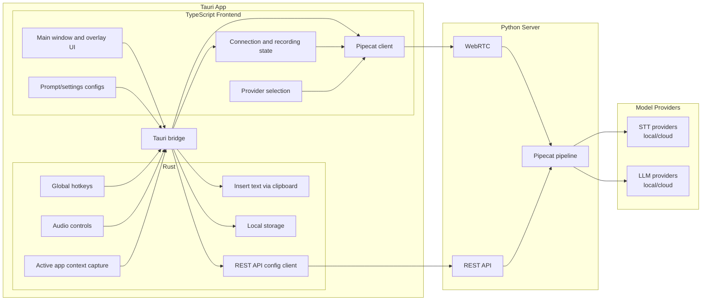

# Tambourine Architecture Diagram

This diagram illustrates ownership boundaries—showing which runtime component is responsible for each feature.

_Last updated: February 11, 2026_

## Caveats

- This is a simplified ownership diagram, not a detailed runtime sequence diagram.
- Arrows indicate primary responsibility and communication direction; they do not represent every code path.
- Behaviors involving both Tauri events and commands are grouped under the "Tauri bridge" abstraction.
- Server internals (e.g., provider switching, audio framing, prompt assembly) are intentionally collapsed for clarity.
- The architecture evolves frequently; please update this document when ownership or flow changes occur.

## 1) Feature Ownership Diagram (High-Level)

## 2) Feature Ownership Matrix (High-Level)

| Component                     | Primary Owner       | Supporting Owner(s)               | Implementation Notes                                                                                                                               |
|------------------------------|---------------------|-----------------------------------|--------------------------------------------------------------------------------------------------------------------------------------------------|
| Global hotkeys               | Rust backend        | TypeScript frontend               | Native shortcut handling for start/stop actions. Uses `tauri-plugin-global-shortcut` with Rust state machine.                                    |
| Audio controls               | Rust backend        | TypeScript frontend               | Native microphone/audio state management exposed via Tauri commands/events.                                                                      |
| Insert text via clipboard    | Rust backend        | TypeScript frontend               | Final text insertion into active application window. Uses platform-specific accessibility APIs via Rust `type_text` command.                     |
| Active app context capture   | Rust backend        | TypeScript frontend, Python server| Context captured natively (macOS: Accessibility APIs/NSWorkspace/CoreGraphics; Windows: Win32/UIA) and forwarded to server for dictation behavior.|
| Local storage                | Rust backend        | TypeScript frontend               | Persistent storage for settings and conversation history. Uses `tauri-plugin-store` with Rust-managed storage layer.                             |
| REST API config client       | Rust backend        | Python server                     | Rust-side client syncing runtime configuration to server. Uses `tauri-plugin-http` (`reqwest`).                                                  |
| Main UI surfaces             | TypeScript frontend | Rust backend                      | User-facing windows and overlays. Built with React + Mantine rendered in Tauri WebView.                                                          |
| Connection/recording state   | TypeScript frontend | Rust backend, Python server       | UX state orchestration for connect/disconnect and recording lifecycle. Uses XState + React hooks.                                                |
| Pipecat client               | TypeScript frontend | Python server, Rust backend       | Realtime client connected to Python server via WebRTC. Uses `@pipecat-ai/client-js` + `@pipecat-ai/small-webrtc-transport`.                      |
| Provider selection           | TypeScript frontend | Python server                     | Selection initiated in UI and transmitted via Pipecat data channel. Uses RTVI client messages over WebRTC.                                       |
| Prompt/settings configuration| TypeScript frontend | Rust backend, Python server       | Config edits flow: frontend → Tauri bridge → Rust REST client → server API. Uses React Query + Tauri invoke + FastAPI endpoints.                 |
| Tauri bridge                 | Rust + TypeScript   | —                                 | Internal communication boundary between frontend and backend. Uses `@tauri-apps/api` (`invoke` for commands, `emit`/`listen` for events).        |
| WebRTC                       | Python server       | TypeScript frontend               | Realtime voice streaming and control channel. Uses Pipecat SmallWebRTC transport with FastAPI signaling endpoints.                               |
| REST API                     | Python server       | Rust backend, TypeScript frontend | Configuration and metadata channel. Built with FastAPI + Pydantic request/response models.                                                       |
| Pipecat pipeline             | Python server       | TypeScript frontend               | Stream/frame orchestration for dictation runtime. Uses Pipecat `Pipeline`, `PipelineTask`, and processor components.                             |
| STT providers                | Model providers     | Python server                     | Speech-to-text inference backends. Integrates via Pipecat STT services (e.g., Whisper, Deepgram).                                                |
| LLM providers                | Model providers     | Python server                     | Language model inference backends. Integrates via Pipecat LLM services (e.g., Ollama, OpenAI).                                                   |

## 3) Communication Channels

| Channel        | Direction                     | Purpose                                      | Technology Stack                                              |
|----------------|-------------------------------|----------------------------------------------|---------------------------------------------------------------|
| **WebRTC**     | Bidirectional (frontend ↔ server) | Realtime voice streaming and control signals | Pipecat SmallWebRTC transport + FastAPI signaling endpoints   |
| **REST API**   | Bidirectional (app ↔ server)     | Configuration sync and metadata exchange     | FastAPI + Pydantic + `tauri-plugin-http` (`reqwest`)          |
| **Tauri bridge**| Bidirectional (frontend ↔ Rust)  | Internal app communication                   | `@tauri-apps/api` (`invoke` for commands, `emit`/`listen` for events) |
